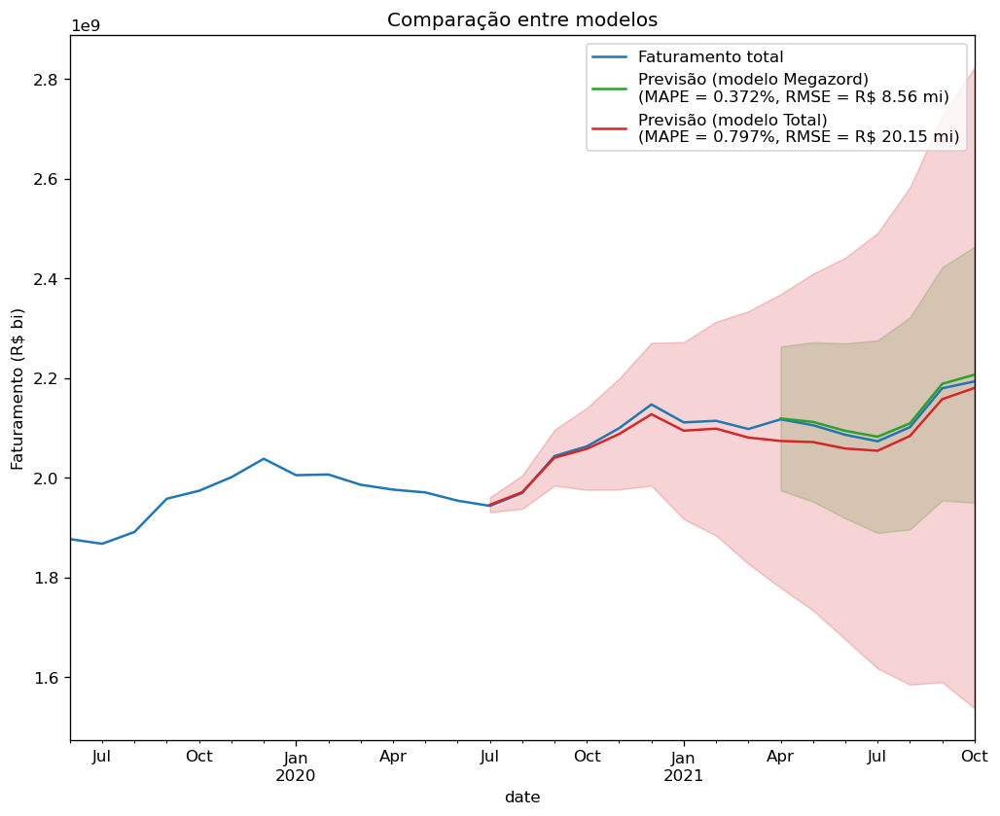
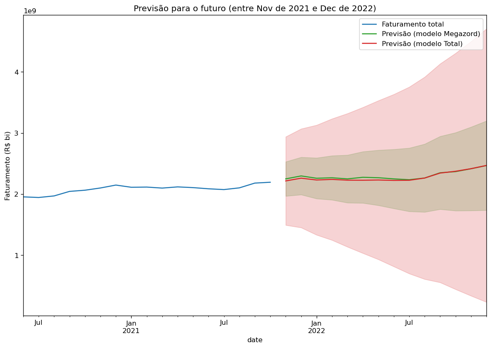

# Previsão do faturamento da empresa de acordo com produtos

Projeto para a disciplina de **Estatística** (Módulo 4) do Data Science Degree (turma de julho de 2020)

## Equipe

* Felipe Lima de Oliveira
* Mário Henrique Romagna Cesa
* Tsuyioshi Valentim Fukuda
* Fernando Raineri Monari

## Case

Imagine que você trabalha numa empresa de benefícios que vende diversos produtos para os RHs clientes, com o intuito de melhorar a qualidade de vida de seus colaboradores por meio de alimentação saudável, transporte, saúde, entre outros.

Para ajudar no direcionamento e estratégia corporativa, bem como definir a meta do time comercial, você ficou encarregado de prever qual seria o faturamento mensal esperado para 2022.

## Etapas de análise

### Etapa I - **EDA - Análise exploratória de dados**

1. Análise das medidas de medidas de posição, dispersão, correlação (análises univaridas e bivariadas) - histograma, boxplot, mapa de calor, etc...
2. Identificação e tratamento de *outliers* e *missings*, caso necessário (sempre explicando a opção)

### Etapa II - **Análise de séries temporais**

1. Ajuste um modelo para o faturamento total (sem quebrar por produto) e realize a projeção para os meses faltantes até o final de 2022.
2. Faça ajustes indivíduais para cada produto e consolide os resultados para obter o faturamento total para os meses faltantes até o final de 2022.
3. Qual dos dois cenários obteve a melhor projeção? Qual cenário você usaria dentro da sua empresa pensando nos desdobramentos estratégicos citados acima? Justifique a sua resposta com base em métricas bem definidas e no entendimento do problema.

## Informações sobre o dataset

* **[sim_ts.txt](data/sim_ts.txt)** - Série temporal sintética com os meses (a data está completa com ano, mês e dia, mas o dia é irrelevante), os valores recebidos e o produto correspondente.

### Campos

* **vlr**: Vlr. faturado no mês
* **date**: Mês de referência do faturamento
* **produto**: Produto ao qual o faturamento diz respeito

## Solução

### I. Análise exploratória de dados

1. [Pré-processamento e tratamento de dados faltantes](notebooks_exploration/1-previsao_faturamento_preproc.ipynb)
2. [Faturamento total](notebooks_exploration/2-faturamento_total.ipynb)
3. [Produto: `alimenticio`](notebooks_exploration/3-produto_alimenticio.ipynb)
4. [Produto: `transporte`](notebooks_exploration/4-produto_transporte.ipynb)
5. [Produto: `saude`](notebooks_exploration/5-produto_saude.ipynb)
6. [Produto: `auxilio_final_de_ano`](notebooks_exploration/6-produto_auxilio.ipynb)
7. [Produto: `bonificacao`](notebooks_exploration/7-produto_bonificacao.ipynb)

### II. Análise de séries temporais

**Os notebooks abaixo necessariamente devem ser executados em sequência** para que os arquivos com os modelos em formato binário sejam criados na pasta `models/`

1. [Modelo para faturamento total](notebooks_models/total_arima.ipynb)
2. Produtos individuais :
   1. [`alimenticio`](notebooks_models/produto_alimenticio_arima.ipynb)
   2. [`transporte`](notebooks_models/produto_transporte_arima.ipynb)
   3. [`saude`](notebooks_models/produto_saude_arima.ipynb)
   4. [`auxilio_final_de_ano`](notebooks_models/produto_auxilio_arima.ipynb)
   5. [`bonificacao`](notebooks_models/produto_bonificacao_arima.ipynb)
   6. [Modelo do faturamento total produto a produto](notebooks_models/todos_produtos_arima.ipynb)

### III. [Comparação entre modelos](notebooks_exploration/8-comparacao.ipynb)

Os arquivos binários criados na pasta `models/` serão lidos por esse notebook para que a comparação seja feita.

### IV. Conclusão

Segue um gráfico comparando algumas métricas:



Segue também a previsão final de cada modelo até dezembro de 2022:



Em resumo, **escolheríamos para uso em produção em nossa empresa o modelo que considera a soma dos modelos de cada produto (batizado de modelo *Megazord*)**, dado que

* apresenta métricas (MAPE, RMSE e MAE) melhores. As métricas refletem diretamente o impacto para o negócio: qual é o erro médio ao se fazer uma previsão de faturamento em uma data qualquer; e
* apresenta intervalo de confiança mais estreito. Esse critério também se relaciona com a probabilidade de se fazer uma previsão errada.

## Ambiente

Para criar o ambiente Anaconda apropriado,

```shell
$ conda env create -f environment.yml
conda: OK
```
